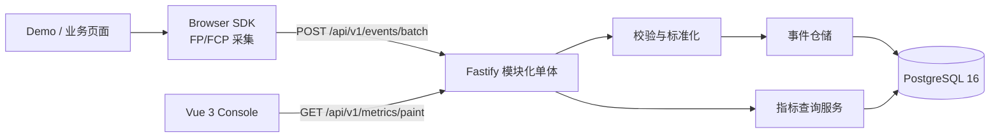
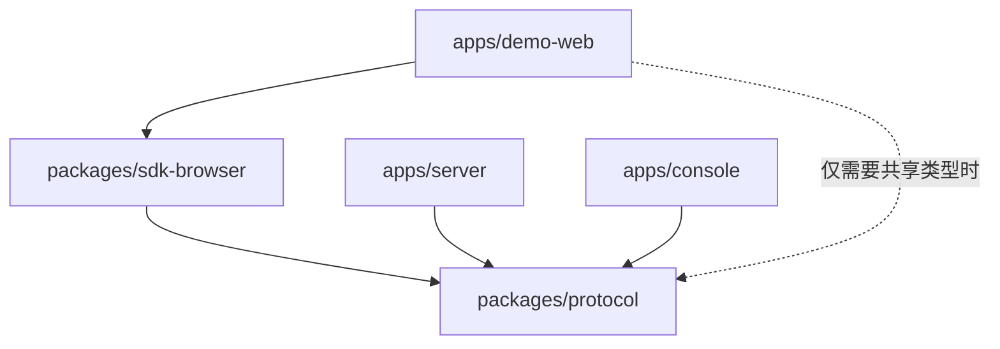
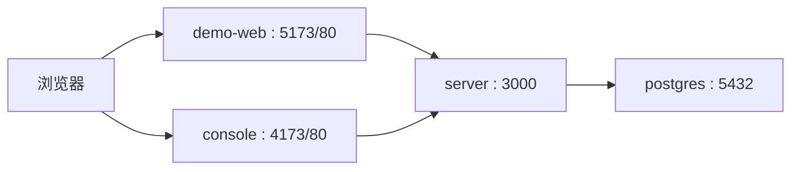

# FP/FCP MVP 0.1 技术方案

## 1. 文档信息

| 项目 | 内容 |
|---|---|
| 文档状态 | 待评审 |
| 适用版本 | MVP 0.1 |
| 目标读者 | 前端、服务端、测试、运维和开源贡献者 |
| 方案范围 | Web FP/FCP 的采集、接收、存储、统计和可视化最小闭环 |
| 关联文档 | `开源多端性能监控与异常诊断平台 PRD.md`、`总体架构.md`、`性能指标与数据口径.md`、`FP:FCP MVP 0.1 实施计划.md` |

### 1.1 文档目的

本文档评审通过后作为 MVP 0.1 的唯一开发技术基线，用于回答以下问题：

- 系统包含哪些组件，组件之间如何协作。
- 各应用和包允许依赖什么，禁止依赖什么。
- SDK 上报的每个字段表示什么。
- 服务端如何校验、标准化和存储事件。
- API 的请求、响应、错误码和时间边界是什么。
- 系统如何测试、部署、观测和验收。

本文档与实施计划冲突时，先修订文档并完成评审，不在代码中隐式改变契约。

## 2. 背景与目标

### 2.1 背景

平台长期目标是支持 Web、小程序、iOS、Android 和桌面应用的性能与异常监控。MVP 0.1 不实现完整平台，只以 Web FP/FCP 验证“真实采集 → 稳定协议 → 可信存储 → 统计查询 → 界面展示”的完整链路。

### 2.2 功能目标

1. Demo 页面接入无框架依赖的浏览器 SDK。
2. SDK 使用 Paint Timing API 采集真实 FP/FCP。
3. SDK 以版本化批量协议上报事件。
4. Fastify API 完成请求边界、批次和单事件校验。
5. PostgreSQL 保存合法明细，对 `eventId` 实现幂等。
6. 查询 API 返回样本量、平均值、P50、P75、P90 和时间序列。
7. Vue Console 处理加载、空数据、失败和正常状态。
8. Docker Compose 能在新环境中启动完整系统。

### 2.3 非目标

MVP 0.1 不包含：

- 登录、团队、RBAC、项目管理和密钥管理。
- 小程序、iOS、Android 和桌面 SDK。
- LCP、CLS、INP、Long Task、网络、资源和异常采集。
- Redis、ClickHouse、Kafka、微服务和 Kubernetes。
- 版本对比、环境筛选和多端筛选界面。
- SDK 离线持久化、远程配置、动态采样和失败重试队列。
- 生产级高可用、多地域容灾和不中断迁移。

## 3. 约束和设计原则

### 3.1 约束

- 单应用，由环境变量固定应用上下文。
- Console 免登录，因此 MVP 不作为公网多租户服务部署。
- 每批最多 20 条事件，HTTP 请求体最大 32 KiB。
- 查询时间范围最大 30 天。
- 事件内的耗时统一使用毫秒。
- 开发与部署基线以实施时锁定的 Node.js LTS、pnpm、PostgreSQL 16 和现行主版本依赖为准；确切版本写入 lockfile 和运行文档。

### 3.2 原则

1. **宿主业务安全优先**：SDK 任何内部失败不得冒泡到业务页面。
2. **协议先于实现**：SDK、Server 和 Console 通过稳定契约协作，不互相导入实现源码。
3. **数据可信**：无数据使用 `null`，不用 `0` 伪装；业务无效与系统失败分类处理。
4. **最小范围**：保留必要演进点，不提前引入 MVP 1.0 组件。
5. **可验证**：纯逻辑单元测试，存储和 HTTP 边界集成测试，完整链路 E2E 测试。

## 4. 系统上下文和高层架构



### 4.1 运行组件

| 组件 | 运行时 | 职责 |
|---|---|---|
| Browser SDK | 浏览器 | 采集 Paint Timing、生成事件、维护有界内存队列、批量上报 |
| Demo Web | 浏览器 | 模拟真实业务页面并接入 SDK，不伪造指标 |
| Console | 浏览器 | 查询和展示摘要、平均值趋势和 P75 趋势 |
| Server | Node.js | HTTP 边界、配置、校验编排、标准化、存储和统计查询 |
| PostgreSQL | PostgreSQL 16 | 事件明细持久化、时间聚合和分位数计算 |

### 4.2 Server 内部边界

```text
HTTP Route
  → Application Service
    → Protocol Validator / Normalizer
      → Repository Interface
        → PostgreSQL Repository
```

- Route 只处理 HTTP 输入输出，不写 SQL。
- Application Service 编排批次校验、单事件校验和仓储调用。
- Protocol Validator 是无 I/O 的纯函数，不信任任何客户端输入。
- Repository Interface 隔离应用逻辑与 PostgreSQL 行模型。

## 5. Monorepo 和依赖边界

### 5.1 目录结构

```text
apps/
  server/            Fastify API
  console/           Vue 3 Console
  demo-web/          SDK 接入 Demo
packages/
  protocol/          公共协议、DTO 和纯校验
  sdk-browser/       无框架依赖的 Web SDK
deploy/
  docker-compose.yml
  docker-compose.test.yml
tests/
  e2e/
```

### 5.2 允许的依赖方向



| 模块 | 允许的内部依赖 |
|---|---|
| `packages/protocol` | 无 |
| `packages/sdk-browser` | `packages/protocol` |
| `apps/server` | `packages/protocol` |
| `apps/console` | `packages/protocol`，优先使用 `import type` |
| `apps/demo-web` | `packages/sdk-browser`；必要时使用 `packages/protocol` 类型 |

### 5.3 禁止的依赖方向

- `protocol` 不得依赖 SDK、Vue、Fastify、`pg` 或任何 `apps/*`。
- `sdk-browser` 不得依赖 Vue、Server 源码、SQL 或 Console。
- Console 不得导入 Server 源码、数据库行类型或直接访问 PostgreSQL。
- Server 不得依赖 Console、Demo 或 Browser SDK 实现。
- 任何 `apps/*` 不得通过相对路径导入另一个应用的源码。
- 共享的是协议 DTO，不是 PostgreSQL 行模型或 Vue 组件内部状态。

## 6. 技术选型

| 领域 | 选型 | 原因 |
|---|---|---|
| 语言 | TypeScript strict mode | 在 SDK、API 和 Console 间建立明确契约 |
| 包管理 | pnpm workspace | 支持 Monorepo、工作区依赖和可重复安装 |
| SDK 构建 | Vite Library Mode | 生成 ESM 和 IIFE/CDN 产物 |
| API | Fastify | 提供请求体限制、高性能 HTTP 边界和 `inject` 测试 |
| Console | Vue 3 + Vite | 与项目长期控制台方向一致 |
| 图表 | ECharts | 时间趋势、分位数、缩放和多维对比能力匹配监控看板 |
| 数据库 | PostgreSQL 16 + `pg` | 在单一组件中验证真实持久化、时间聚合和 `percentile_cont` |
| 测试 | Vitest + Vue Test Utils + Playwright | 覆盖纯逻辑、组件、HTTP、数据库和 E2E |
| 部署 | Docker Compose + Nginx | 保持自托管和一键启动 |

## 7. 事件协议

### 7.1 版本概念

一条事件同时携带三种版本，三者不得混用：

| 字段 | 示例 | 语义 |
|---|---|---|
| `schemaVersion` | `"1.0"` | 事件 JSON 协议版本，决定服务端如何解析 |
| `application.version` | `"1.0.2"` | 被监控应用的发布版本，用于定位性能回退 |
| `runtime.sdk.version` | `"0.1.0"` | 采集 SDK 版本，用于排查采集差异 |

`schemaVersion` 不是应用版本。新增必填字段、改变字段语义或删除字段时，必须按协议兼容规则评估是否升级 `schemaVersion`。

### 7.2 TypeScript 定义

```ts
export type Environment =
  | 'development'
  | 'test'
  | 'staging'
  | 'production'

export type PaintMetric =
  | 'web.paint.fp'
  | 'web.paint.fcp'

export interface PaintEventV1 {
  schemaVersion: '1.0'
  eventId: string
  type: PaintMetric
  timestamp: number

  application: {
    id: string
    version: string
    environment: Environment
  }

  runtime: {
    platform: 'web'
    sdk: {
      name: string
      version: string
    }
  }

  session: {
    sessionId: string
    viewId: string
  }

  payload: {
    value: number
    unit: 'ms'
  }
}

export interface BatchRequestV1 {
  events: PaintEventV1[]
}
```

MVP 中 `runtime.platform` 只允许 `web`。字段从第一版存在，是为了建立多端数据边界，不表示 MVP 已支持小程序或 App。

### 7.3 字段字典

| 路径 | 类型 | 必填 | 语义和约束 |
|---|---|---:|---|
| `schemaVersion` | `'1.0'` | 是 | 事件协议版本 |
| `eventId` | UUID string | 是 | 单事件唯一 ID，用于幂等；必须是标准 UUID |
| `type` | `PaintMetric` | 是 | FP 或 FCP 的精确指标语义 |
| `timestamp` | number | 是 | 指标实际发生时间，Unix epoch 毫秒整数 |
| `application.id` | string | 是 | 被监控应用稳定标识，1–64 字符 |
| `application.version` | string | 是 | 业务发布版本，1–64 字符，由构建/发布系统注入 |
| `application.environment` | `Environment` | 是 | 开发、测试、预发或生产环境 |
| `runtime.platform` | `'web'` | 是 | 运行端；MVP 只接受 Web |
| `runtime.sdk.name` | string | 是 | SDK 名称，1–128 字符 |
| `runtime.sdk.version` | string | 是 | SDK 发布版本，1–64 字符 |
| `session.sessionId` | string | 是 | 标签页会话标识，1–128 字符 |
| `session.viewId` | string | 是 | 本次页面加载标识，1–128 字符 |
| `payload.value` | number | 是 | 相对导航起点的绘制耗时，有限、非负且小于 86,400,000 ms |
| `payload.unit` | `'ms'` | 是 | 固定为毫秒 |

### 7.4 时间语义

`payload.value` 回答“从导航开始到这次绘制花了多久”；`timestamp` 回答“这次绘制在绝对时间上何时发生”。

```ts
const value = entry.startTime
const timestamp = Math.round(performance.timeOrigin + entry.startTime)
```

不得使用观察器回调执行时的 `Date.now()` 代替事件实际发生时间。

服务端接受的 `timestamp` 必须位于“当前服务端时间前 30 天”到“当前服务端时间后 5 分钟”之间。超出范围时以 `invalid_timestamp` 丢弃单事件。

### 7.5 ID 生命周期

| ID | 生成时机 | 复用规则 |
|---|---|---|
| `eventId` | 创建每条 FP/FCP 事件时 | 永不为不同事件复用 |
| `sessionId` | 当前标签页会话首次初始化时 | 优先存入 `sessionStorage`，同标签页刷新可复用；不可用时退化为内存 ID |
| `viewId` | 每次完整页面加载时 | 同一页面的 FP/FCP 复用；刷新后更换 |

### 7.6 事件示例

```json
{
  "schemaVersion": "1.0",
  "eventId": "075f9a46-f934-45e3-b355-e20490e90bb4",
  "type": "web.paint.fcp",
  "timestamp": 1787536800260,
  "application": {
    "id": "demo-web",
    "version": "0.1.0+20260824.1",
    "environment": "development"
  },
  "runtime": {
    "platform": "web",
    "sdk": {
      "name": "@performance-platform/browser",
      "version": "0.1.0"
    }
  },
  "session": {
    "sessionId": "ses_e77d33",
    "viewId": "view_23b68a"
  },
  "payload": {
    "value": 260.4,
    "unit": "ms"
  }
}
```

### 7.7 协议兼容规则

- 新增可选字段可保持 `1.0`，老客户端和服务端必须忽略未知可选字段。
- 新增必填字段、改变字段类型/语义或删除字段属于不兼容变更，需要新协议版本。
- 服务端对不支持的版本返回单事件丢弃原因 `unsupported_schema_version`，不因一条事件终止整批。
- 数据库保留 `schema_version`，为并行兼容和迁移提供依据。

## 8. SDK 设计

### 8.1 初始化配置

```ts
export interface PaintMonitorConfig {
  appId: string
  appVersion: string
  environment: Environment
  endpoint: string
  debug?: (message: string, error?: unknown) => void
}

export interface PaintMonitor {
  start(): void
  flush(): Promise<void>
  destroy(): void
}
```

Demo 中的 `appVersion` 应由构建变量、Git commit SHA 或 CI 发布号注入，不使用无法追溯的 `latest`。

### 8.2 采集

- 通过能力检测确认 `PerformanceObserver` 和 `paint` 可用。
- 使用 `{ type: 'paint', buffered: true }` 读取 SDK 初始化前已产生的条目。
- `first-paint` 映射为 `web.paint.fp`。
- `first-contentful-paint` 映射为 `web.paint.fcp`。
- 未知 paint 名称、非 number、`NaN`、无穷大和负值静默忽略，可通过 `debug` 暴露原因。
- `start()` 幂等，不重复安装观察器和页面事件。
- `destroy()` 断开观察器、移除监听器且后续 `start()` 行为在测试中明确锁定。

### 8.3 内存队列和上报

- 队列最多 20 条，不使用 `localStorage` 或 IndexedDB 持久化。
- 观察到当前 paint 条目后触发一次 `flush()`。
- 页面转入 `hidden` 时再次尝试 `flush()`。
- 页面隐藏/退出优先使用 `navigator.sendBeacon`，其他场景可使用 `fetch`。
- `sendBeacon()` 返回 `true` 仅表示浏览器接受发送任务，MVP 将其视为可从内存队列移除。
- `sendBeacon()` 返回 `false` 时使用 `fetch` 降级。
- `fetch` 只在收到 2xx 响应时移除对应队列数据。
- 上报失败不抛给宿主业务；MVP 不实现跨页持久化重试。

### 8.4 失败隔离

SDK 必须在以下边界隔离异常：

- 浏览器 API 能力检测和观察器创建。
- `sessionStorage` 读写。
- ID 生成、事件构建和 JSON 序列化。
- Beacon/fetch 上报。
- 用户提供的 `debug` 回调。

## 9. 校验和标准化

### 9.1 分层校验

```text
HTTP 边界校验
  → 批次结构校验
    → 单事件协议校验
      → 应用上下文校验
        → 标准化
          → 仓储
```

| 层级 | 示例 | 处理 |
|---|---|---|
| HTTP 边界 | 非 JSON、请求体超限 | 整个请求失败 |
| 批次 | `events` 缺失、空数组、超过 20 条 | 整个请求失败 |
| 单事件 | 负值、未知类型、错误平台 | 丢弃该事件，继续处理同批其他事件 |
| 系统失败 | PostgreSQL 不可用 | 不计入业务丢弃，返回 HTTP 503 |

### 9.2 校验结果

```ts
export type ValidationResult<T> =
  | { ok: true; value: T }
  | { ok: false; reason: DiscardReason }
```

单事件校验对不可信输入不抛异常。

### 9.3 丢弃原因

```ts
export type DiscardReason =
  | 'unsupported_schema_version'
  | 'invalid_event_id'
  | 'invalid_app_id'
  | 'invalid_app_version'
  | 'invalid_environment'
  | 'unsupported_event_type'
  | 'invalid_timestamp'
  | 'invalid_platform'
  | 'platform_event_mismatch'
  | 'invalid_session_id'
  | 'invalid_view_id'
  | 'invalid_sdk'
  | 'invalid_value'
  | 'invalid_unit'
```

MVP 要求 `type` 为 `web.paint.*` 时 `runtime.platform` 必须为 `web`，不一致时使用 `platform_event_mismatch`。

### 9.4 标准化规则

- 将 Unix 毫秒 `timestamp` 转换为 PostgreSQL `TIMESTAMPTZ`。
- 只接受 `ms`，将数值存入 `value_ms`，不在数据库重复存储固定单位。
- 不对未知枚举做默默矫正。
- 不使用默认值填充必填的应用版本、环境或平台。

## 10. 数据存储设计

### 10.1 存储模型

```sql
CREATE TABLE paint_events (
  id BIGSERIAL PRIMARY KEY,
  event_id UUID NOT NULL UNIQUE,
  schema_version TEXT NOT NULL,

  app_id TEXT NOT NULL,
  app_version TEXT NOT NULL,
  environment TEXT NOT NULL
    CHECK (environment IN (
      'development', 'test', 'staging', 'production'
    )),

  platform TEXT NOT NULL
    CHECK (platform = 'web'),
  event_type TEXT NOT NULL
    CHECK (event_type IN ('web.paint.fp', 'web.paint.fcp')),

  event_time TIMESTAMPTZ NOT NULL,
  received_at TIMESTAMPTZ NOT NULL DEFAULT now(),

  session_id TEXT NOT NULL,
  view_id TEXT NOT NULL,
  sdk_name TEXT NOT NULL,
  sdk_version TEXT NOT NULL,

  value_ms DOUBLE PRECISION NOT NULL
    CHECK (value_ms >= 0 AND value_ms < 86400000)
);

CREATE INDEX paint_events_query_idx
  ON paint_events (app_id, event_type, event_time);
```

`value_ms < 86400000` 同时提供业务上限与数据库最后一道保护；应用层仍必须使用 `Number.isFinite()` 拒绝 `NaN` 和无穷大。

### 10.2 字段字典

| 列 | 来源 | 语义 |
|---|---|---|
| `id` | 数据库生成 | 内部自增主键，不对外暴露 |
| `event_id` | `eventId` | 客户端事件唯一 ID，唯一约束实现幂等 |
| `schema_version` | `schemaVersion` | 事件协议版本 |
| `app_id` | `application.id` | 被监控应用标识 |
| `app_version` | `application.version` | 被监控应用的发布版本 |
| `environment` | `application.environment` | 事件所属环境 |
| `platform` | `runtime.platform` | 运行端，MVP 固定为 Web |
| `event_type` | `type` | FP 或 FCP |
| `event_time` | `timestamp` | 客户端指标实际发生时间 |
| `received_at` | 服务端生成 | 服务端接收并写入事件的时间 |
| `session_id` | `session.sessionId` | 标签页会话标识 |
| `view_id` | `session.viewId` | 本次页面加载标识 |
| `sdk_name` | `runtime.sdk.name` | SDK 名称 |
| `sdk_version` | `runtime.sdk.version` | SDK 版本 |
| `value_ms` | `payload.value` | 标准化后的毫秒耗时 |

### 10.3 幂等语义

插入使用 `event_id` 唯一约束和 `ON CONFLICT (event_id) DO NOTHING`。相同 `eventId` 的重复上报视为幂等成功，不重复计算，也不属于业务丢弃。

### 10.4 查询边界

所有时间范围使用左闭右开区间 `[from, to)`：

```sql
WHERE event_time >= $from
  AND event_time < $to
```

相邻时间窗口因此不会重复统计边界事件。

`interval` 只能由应用层白名单映射为 SQL 片段，不得将客户端字符串直接插值到 SQL。其他参数全部使用参数化查询。

## 11. HTTP API 契约

### 11.1 通用约定

- 路径前缀：`/api/v1`。API 路径版本与事件 `schemaVersion` 相互独立。
- 请求与响应字符集：UTF-8。
- JSON 请求使用 `Content-Type: application/json`。Beacon 场景使用 JSON `Blob` 确保媒体类型正确。
- 时间响应使用 ISO 8601 UTC 字符串。
- 非 2xx 响应使用统一错误信封。
- 服务端不向客户端返回堆栈、SQL、数据库凭据或内部路径。

### 11.2 批量接收

```http
POST /api/v1/events/batch
Content-Type: application/json
```

批次请求：

```json
{
  "events": [
    {
      "schemaVersion": "1.0",
      "eventId": "075f9a46-f934-45e3-b355-e20490e90bb4",
      "type": "web.paint.fcp",
      "timestamp": 1787536800260,
      "application": {
        "id": "demo-web",
        "version": "0.1.0+20260824.1",
        "environment": "development"
      },
      "runtime": {
        "platform": "web",
        "sdk": {
          "name": "@performance-platform/browser",
          "version": "0.1.0"
        }
      },
      "session": {
        "sessionId": "ses_e77d33",
        "viewId": "view_23b68a"
      },
      "payload": {
        "value": 260.4,
        "unit": "ms"
      }
    }
  ]
}
```

成功或部分成功响应：

```ts
export interface BatchResponse {
  accepted: number
  discarded: number
  reasons: Partial<Record<DiscardReason, number>>
}
```

```json
{
  "accepted": 1,
  "discarded": 1,
  "reasons": {
    "invalid_value": 1
  }
}
```

`accepted` 表示已被系统有效处理，包含新插入和识别为幂等重复的事件。MVP 不额外暴露 `inserted` 和 `duplicated`。

### 11.3 指标查询

```http
GET /api/v1/metrics/paint?from=...&to=...&interval=hour
```

| 参数 | 必填 | 默认值 | 规则 |
|---|---:|---|---|
| `from` | 否 | 当前时间前 24 小时 | 可解析的 ISO 8601 时间 |
| `to` | 否 | 当前时间 | 可解析的 ISO 8601 时间 |
| `interval` | 否 | `hour` | `minute` / `hour` / `day` |

时间范围必须满足 `from < to` 且不超过 30 天。

```ts
export type MetricsInterval = 'minute' | 'hour' | 'day'

export interface PaintStats {
  count: number
  average: number | null
  p50: number | null
  p75: number | null
  p90: number | null
}

export interface PaintSeriesPoint {
  time: string
  fp: PaintStats
  fcp: PaintStats
}

export interface PaintMetricsResponse {
  range: {
    from: string
    to: string
    interval: MetricsInterval
  }
  summary: {
    fp: PaintStats
    fcp: PaintStats
  }
  series: PaintSeriesPoint[]
}
```

空数据时返回：

```json
{
  "count": 0,
  "average": null,
  "p50": null,
  "p75": null,
  "p90": null
}
```

`0` 表示真实测量值为零，`null` 表示没有可用样本，两者不得混淆。

时间序列由服务端补齐查询范围内的时间桶；空桶的 `count` 为 `0`，其余统计值为 `null`。Console 不自行推断缺失时间桶。

### 11.4 健康检查

MVP 对外提供：

```http
GET /health
```

它是就绪检查，包含 PostgreSQL 连接检查。

就绪时：

```json
{
  "status": "ready",
  "checks": {
    "database": "ok"
  }
}
```

数据库不可用时返回 HTTP 503：

```json
{
  "status": "not_ready",
  "checks": {
    "database": "unavailable"
  }
}
```

## 12. 错误契约

### 12.1 统一错误信封

```ts
export interface ApiErrorResponse {
  error: {
    code: ApiErrorCode
    message: string
    requestId: string
    details?: Record<string, unknown>
  }
}
```

```json
{
  "error": {
    "code": "INVALID_TIME_RANGE",
    "message": "from must be earlier than to",
    "requestId": "req-01J60MVTTM7JQ8XW3A6FS53RBC",
    "details": {
      "from": "2026-08-24T12:00:00.000Z",
      "to": "2026-08-24T10:00:00.000Z"
    }
  }
}
```

- `code` 是稳定的程序判断字段。
- `message` 是简短的开发者说明，不作为 Console 的分支判断依据。
- `requestId` 用于关联服务端日志。
- `details` 只包含安全、有界、可用于修正请求的上下文。

### 12.2 批量上报错误

| HTTP | `code` | 场景 |
|---:|---|---|
| 400 | `INVALID_JSON` | JSON 无法解析 |
| 400 | `INVALID_BATCH` | `events` 缺失、非数组或为空 |
| 400 | `BATCH_TOO_LARGE` | 超过 20 条事件 |
| 413 | `PAYLOAD_TOO_LARGE` | 请求体超过 32 KiB |
| 415 | `UNSUPPORTED_MEDIA_TYPE` | 不支持的媒体类型 |
| 500 | `INTERNAL_ERROR` | 未预期的服务端错误 |
| 503 | `STORAGE_UNAVAILABLE` | PostgreSQL 暂时不可用 |

单事件无效使用 HTTP 200 中的 `discarded/reasons` 表达，不使用整个批次的 HTTP 400。

### 12.3 指标查询错误

| HTTP | `code` | 场景 |
|---:|---|---|
| 400 | `INVALID_DATE` | `from` 或 `to` 不是有效 ISO 8601 时间 |
| 400 | `INVALID_INTERVAL` | `interval` 不在白名单中 |
| 400 | `INVALID_TIME_RANGE` | `from >= to` |
| 400 | `TIME_RANGE_TOO_LARGE` | 查询范围超过 30 天 |
| 500 | `INTERNAL_ERROR` | 未预期服务端错误 |
| 503 | `STORAGE_UNAVAILABLE` | PostgreSQL 不可用 |

### 12.4 错误分类原则

```text
整个 HTTP 请求不可处理  → 非 2xx + ApiErrorResponse
请求可处理，单事件无效 → 200 + discarded/reasons
事件有效，基础设施失败   → 503，不计入 discarded
重复 eventId                  → 幂等成功，不重复写入
```

## 13. 指标计算口径

### 13.1 摘要

按 `app_id`、`event_type` 和 `[from, to)` 过滤，分别计算 FP 和 FCP：

- `count(*)`
- `avg(value_ms)`
- `percentile_cont(0.50) WITHIN GROUP (ORDER BY value_ms)`
- `percentile_cont(0.75) WITHIN GROUP (ORDER BY value_ms)`
- `percentile_cont(0.90) WITHIN GROUP (ORDER BY value_ms)`

MVP 不对同一会话额外去重；事件级重复已由 `event_id` 唯一约束消除。

### 13.2 时间序列

- `minute`、`hour`、`day` 分别映射到已审核的时间截断 SQL。
- 时间桶使用 UTC 计算和返回，Console 根据用户本地时区格式化展示。
- 日粒度也以 UTC 边界为准；MVP 不提供项目时区配置。
- 时间桶补齐使用与查询一致的 `[from, to)` 语义。

### 13.3 数值精度

- 数据库保存原始毫秒小数。
- API 保留 JavaScript number，不预先转换为字符串。
- Console 显示时可四舍五入为整数毫秒，Tooltip 可按需保留一位小数。

## 14. Console 设计

### 14.1 页面范围

- 页面标题和最近更新时间。
- 时间范围：最近 1 小时、24 小时、7 天、30 天。
- FP 和 FCP 摘要：样本量、平均值、P50、P75、P90。
- FP/FCP 平均值趋势图。
- FP/FCP P75 趋势图。
- SDK 接入说明入口。

### 14.2 时间范围映射

| UI 选项 | API `interval` |
|---|---|
| 1 小时 | `minute` |
| 24 小时 | `hour` |
| 7 天 | `day` |
| 30 天 | `day` |

### 14.3 状态模型

```ts
type LoadState =
  | { status: 'idle' }
  | { status: 'loading'; requestId: number }
  | { status: 'success'; data: PaintMetricsResponse }
  | { status: 'empty'; data: PaintMetricsResponse }
  | { status: 'error'; error: DisplayError }
```

- 时间范围变化时，旧请求响应不得覆盖新请求。
- `count: 0` 且无任何 FP/FCP 样本时进入空数据状态。
- `null` 统计值显示为 `—`，不显示 `0 ms`。
- 错误状态提供重试，不暴露服务端内部细节。
- ECharts 按需导入必要系列和组件，不引入 3D 扩展。

## 15. 配置和环境变量

### 15.1 Server

| 变量 | 必填 | 示例 | 含义 |
|---|---:|---|---|
| `PORT` | 否 | `3000` | HTTP 监听端口 |
| `DATABASE_URL` | 是 | `postgres://...` | PostgreSQL 连接字符串 |
| `APP_ID` | 是 | `demo-web` | MVP 接受的固定应用 ID |
| `CORS_ORIGINS` | 是 | `http://localhost:5173,...` | 允许的精确 Origin 列表 |
| `LOG_LEVEL` | 否 | `info` | 日志级别 |

### 15.2 Demo Web

| 变量 | 必填 | 示例 | 含义 |
|---|---:|---|---|
| `VITE_MONITOR_ENDPOINT` | 是 | `http://localhost:3000/api/v1/events/batch` | 上报端点 |
| `VITE_APP_ID` | 是 | `demo-web` | 应用 ID |
| `VITE_APP_VERSION` | 是 | `0.1.0+dev` | 应用发布版本 |
| `VITE_APP_ENVIRONMENT` | 是 | `development` | 应用环境 |

### 15.3 Console

| 变量 | 必填 | 示例 | 含义 |
|---|---:|---|---|
| `VITE_API_BASE_URL` | 是 | `http://localhost:3000` | Platform API 根地址 |

浏览器端 `VITE_*` 变量会进入构建产物，不得放入数据库凭据或任何秘密。`APP_ID` 在 MVP 中是识别符，不是身份认证密钥。

## 16. 安全与隐私

### 16.1 HTTP 边界

- Fastify 请求体限制为 32 KiB。
- 批次事件数限制为 20。
- CORS 只允许显式配置的 Demo 和 Console Origin。
- CORS 不是身份认证；MVP 免登录 API 不应暴露在不可信公网。
- 所有 SQL 使用参数化查询，只有经白名单映射的 interval SQL 片段可静态拼接。
- 生产化部署必须在 TLS 反向代理之后；MVP 本地 Compose 可使用 HTTP。

### 16.2 数据最小化

MVP 不采集：

- URL 查询参数、Cookie、Authorization Header。
- 请求/响应正文。
- 用户输入、DOM 内容、录屏和键盘事件。
- IP、账号、邮箱、手机号等个人识别信息。

`sessionId` 和 `viewId` 是随机技术标识，不得编码业务用户信息。

### 16.3 日志脱敏

- 日志记录 request ID、路由、状态码、耗时、accepted/discarded 计数和低基数 reason。
- 默认不记录整个事件、整个请求体或数据库连接字符串。
- 未预期异常在服务端记录堆栈，客户端只收到 `INTERNAL_ERROR` 和 `requestId`。

## 17. 非功能要求

### 17.1 性能和容量基线

MVP 指标是开发与验收基线，不是公网 SLA：

| 项目 | 基线 |
|---|---|
| 单批事件数 | 1–20 |
| 单请求体 | ≤ 32 KiB |
| 单次查询范围 | ≤ 30 天 |
| 上报 API 目标 | 本地标准环境下 p95 < 200 ms，不含客户端网络 |
| 指标 API 目标 | 日常数据量下 p95 < 500 ms |
| 日事件量 | MVP 验证环境目标 ≤ 100 万，超出后重新容量测试 |

任何性能数值在转为发布门禁前，必须在确定的硬件、数据规模和压测脚本下复测并记录。

### 17.2 可用性和恢复

- MVP 不承诺高可用 SLA，采用单 Server 和单 PostgreSQL。
- SDK/API 不可用时，Demo 业务页面必须继续工作。
- 建议自托管用户每日备份 PostgreSQL；MVP 参考 RPO 为 24 小时、RTO 为 4 小时，实际取决于部署方的备份策略。
- 数据库重启后，已提交的事件不得丢失；尚未发送且仅在 SDK 内存队列中的事件可能丢失，这是 MVP 已知限制。

### 17.3 兼容性

- SDK 按能力检测退化，不依赖浏览器名称判断。
- 最低浏览器矩阵在发布前根据产物目标单独锁定；不支持 Paint Timing 的浏览器不上报 FP/FCP，不伪造 `0`。
- Server 必须能在单批中隔离未知协议和非法事件。

### 17.4 可维护性

- TypeScript 启用 `strict`、`noUncheckedIndexedAccess`、`exactOptionalPropertyTypes` 和 `useUnknownInCatchVariables`。
- 所有数据库变更通过顺序迁移文件完成。
- 仓储层、路由层和协议校验有独立测试边界。
- 重大方案变更必须修订本文档或新增 ADR。

## 18. 可观测性

### 18.1 结构化日志

每个 HTTP 请求至少记录：

```text
timestamp
level
requestId
method
route
statusCode
durationMs
```

批量上报追加：

```text
accepted
discarded
discardReasons
```

不将 `sessionId`、`viewId` 和原始事件作为默认日志字段。

### 18.2 健康和运维信号

- `/health` 表示 API 和数据库是否就绪。
- Docker Compose 使用健康检查作为服务启动依赖。
- MVP 不引入 Prometheus/OpenTelemetry，但日志字段不应阻碍后续接入。

## 19. 失效模式和处理

| 失效模式 | 影响 | 处理 |
|---|---|---|
| 浏览器不支持 Paint Timing | 没有 FP/FCP 事件 | SDK 静默停用该采集器，Demo 继续运行 |
| `sessionStorage` 被禁止 | 会话 ID 无法跨刷新复用 | 退化为内存 ID |
| Beacon 不可用/拒绝 | 退出上报可能失败 | 尝试 fetch，不影响业务 |
| 网络/API 不可用 | 当前内存队列可能丢失 | 记录 debug，MVP 不持久化重试 |
| 单事件非法 | 该样本不可用 | 部分成功，返回丢弃原因计数 |
| PostgreSQL 不可用 | 上报和查询不可用 | `/health` 和 API 返回 503，不伪装业务丢弃 |
| 重复上报 | 可能重复统计 | `event_id` 唯一约束 + conflict ignore |
| Console 旧请求后返回 | 旧时间范围覆盖新数据 | AbortController 或递增 request ID 忽略过期响应 |
| 无数据 | 用户可能误以为指标为 0 | API 返回 `null`，Console 显示 `—` 和接入指引 |

## 20. 测试策略

### 20.1 测试分层

| 层级 | 对象 | 关键场景 |
|---|---|---|
| 单元测试 | Protocol | 合法/非法事件、版本、平台、环境、有限数、边界长度 |
| 单元测试 | SDK | 观察器、`buffered`、映射、幂等启动、销毁、缺失 API |
| 单元测试 | Reporter | Beacon、fetch 降级、队列清理和失败隔离 |
| 集成测试 | PostgreSQL Repository | 插入、幂等、时间边界、空摘要、分位数 |
| 集成测试 | Fastify Routes | 请求体限制、批次错误、部分成功、错误信封、查询参数 |
| 组件测试 | Vue Console | loading/empty/error/success、过期响应、null 格式化 |
| E2E | 完整系统 | Demo 真实产生 FP/FCP，API 入库，Console 展示 |

### 20.2 测试原则

- 协议、SDK、仓储、API 和 UI 状态先写失败测试再实现。
- 分位数测试使用已知数据集，明确连续分位数预期值。
- E2E 不人工构造 FP/FCP，使用真实浏览器 Paint Timing 条目。
- 时间相关单元测试注入可控时钟，不依赖实时 `Date.now()`。
- 数据库集成测试使用独立测试库，不共享开发/生产数据。

### 20.3 发布前验证

```bash
pnpm typecheck
pnpm test
pnpm build
pnpm exec playwright test
docker compose -f deploy/docker-compose.yml config --quiet
```

上述命令及清洁 Docker Compose 环境烟雾测试全部通过后才可宣布 MVP 完成。

## 21. 部署设计

### 21.1 Compose 服务



Compose 包含：

- `postgres`：数据卷、健康检查。
- `server`：等待 PostgreSQL 就绪，执行/依赖已完成迁移，提供 API。
- `console`：Nginx 托管静态产物。
- `demo-web`：Nginx 托管 Demo 产物。

### 21.2 迁移

- 迁移文件按数字顺序执行，已执行状态由迁移表记录。
- 数据库不依赖应用启动时的隐式 `CREATE TABLE IF NOT EXISTS` 代替可追溯迁移。
- 迁移失败时 Server 不进入就绪状态。

## 22. 关键架构决策（ADR 摘要）

### ADR-001：MVP 使用模块化单体

- **状态**：待评审
- **背景**：MVP 只有 FP/FCP 两类事件，目标是验证闭环而非独立扩容。
- **决策**：HTTP、校验、标准化、仓储和查询放在同一 Fastify 进程，内部保持模块边界。
- **正向后果**：部署简单、本地调试方便、不引入分布式故障。
- **负向后果**：接入与查询不能独立扩容；通过内部接口为后续拆分保留边界。
- **备选方案**：微服务 + 队列 + ClickHouse；因 MVP 运维咍发复杂度过高而不采用。

### ADR-002：MVP 使用 PostgreSQL 明细表与即时聚合

- **状态**：待评审
- **背景**：需要验证真实持久化、唯一约束、时间范围和分位数。
- **决策**：PostgreSQL 16 保存明细并使用 `percentile_cont` 即时聚合。
- **正向后果**：组件少、约束强、SQL 可验证。
- **负向后果**：数据增长后即时聚合成本上升。
- **演进触发器**：30 天查询稳定超过性能基线、事件量明显超过 MVP 目标或需要多维高并发分析时，评估预聚合/ClickHouse。
- **备选方案**：JSON 文件无持久化可信性；ClickHouse 对 MVP 过度设计。

### ADR-003：使用版本化、分组的事件协议

- **状态**：待评审
- **背景**：平台长期要支持多应用、多版本、多环境和多端。
- **决策**：事件显式包含 `schemaVersion`、`application`、`runtime`、`session` 和 `payload`；MVP 的 platform 固定为 `web`。
- **正向后果**：语义清晰，协议版本、应用版本和 SDK 版本相互独立。
- **负向后果**：比平铺协议更长，校验项更多。
- **备选方案**：只保留 `appId/type/value`；无法支持发布回归、数据治理和多端演进，不采用。

### ADR-004：控制台使用 ECharts，MVP 不使用 3D

- **状态**：待评审
- **背景**：当前需求是时间趋势和分位数对比，需要精确读数。
- **决策**：模块化使用 ECharts 二维折线图，不引入 ECharts-GL。
- **正向后果**：交付快、包体可控、不使用透视效果干扰性能读数。
- **负向后果**：当出现明确地理或大规模 WebGL 场景时需单独评估扩展。
- **备选方案**：AntV G2 和 ECharts-GL；对当前固定 APM 看板没有足够收益。

### ADR-005：区分结构错误、业务丢弃和系统失败

- **状态**：待评审
- **背景**：批量协议需要保留合法事件，同时不能将数据库故障伪装为客户端数据问题。
- **决策**：请求/批次结构错误使用非 2xx；单事件无效使用 200 部分成功；存储故障使用 503。
- **正向后果**：语义稳定，可统计业务丢弃原因，可正确诊断基础设施。
- **负向后果**：客户端需同时理解 HTTP 错误和批次业务结果。

## 23. 风险与缓解

| 风险 | 可能性 | 影响 | 缓解 |
|---|---|---|---|
| Paint Timing 浏览器覆盖有限 | 中 | 部分用户无数据 | 能力检测，不以 0 代替，后续增加能力位 |
| Beacon 成功不代表服务端入库 | 中 | 退出场景可能丢数据 | 文档化已知限制，后续引入有界持久化与确认策略 |
| 客户端时钟偏差 | 中 | 时间趋势偏移 | 限制 timestamp 窗口，同时保存 `received_at` |
| PostgreSQL 即时分位数随数据增长变慢 | 中 | 查询延迟增加 | 索引、限制 30 天，超过触发器后评估预聚合/ClickHouse |
| 免登录 API 被公网滥用 | 高 | 污染数据、消耗资源 | 限定为本地/受信网络，请求限制，MVP 1.0 引入密钥与限流 |
| 应用版本注入不准确 | 中 | 无法做发布回归分析 | 启动时必填、由 CI/CD 注入、禁止 `latest` |

## 24. 验收标准

### 24.1 功能验收

1. Docker Compose 可从清洁环境启动 PostgreSQL、Server、Console 和 Demo。
2. Demo 接入 SDK 后自动上报真实 FP/FCP，不人工伪造数值。
3. 数据库保存协议版本、应用 ID/版本/环境、平台、SDK 版本和时间语义。
4. 非法数值、未知类型、错误平台和不支持协议被正确丢弃。
5. 批次部分成功时返回稳定 reason 计数，合法事件正常入库。
6. 重复 `eventId` 不重复入库或计算。
7. 指标 API 正确返回样本量、平均值、P50、P75、P90 和完整时间桶。
8. Console 正确展示加载、空数据、失败和正常状态。
9. SDK 或 Server 不可用时，Demo 业务功能不受影响。

### 24.2 质量验收

- `pnpm typecheck`、`pnpm test`、`pnpm build` 全部通过。
- PostgreSQL 仓储集成测试在独立测试数据库通过。
- Playwright 真实浏览器 E2E 链路通过。
- Docker Compose 配置校验和健康检查通过。
- 代码不违反第 5 章的包依赖方向。

## 25. 实施顺序

1. 工作区和质量基础。
2. 版本化协议、DTO 和纯校验。
3. Browser SDK 采集和 Reporter。
4. PostgreSQL 迁移和 Repository。
5. Fastify 上报、指标和健康 API。
6. Vue Console 数据客户端、状态和图表。
7. Demo Web。
8. Docker Compose 和运维文档。
9. Playwright E2E 与发布验收。

实施中不得跳过协议测试直接将 SDK 输入写入数据库，也不得让 Console 依赖 SQL 或数据库行结构。

## 26. 待评审项

以下项目在进入 Task 1 前由项目维护者确认：

- [x] 接受嵌套的 `application/runtime/session/payload` 协议结构。
- [x] 接受 MVP 必填 `application.version`、`application.environment` 和 `runtime.platform = web`。
- [x] 接受 `timestamp = performance.timeOrigin + entry.startTime` 的时间语义。
- [x] 接受 `[from, to)`、UTC 时间桶和 30 天最大范围。
- [x] 接受结构错误/单事件丢弃/存储故障的三类错误语义。
- [x] 接受 MVP 免登录仅用于本地或受信网络，`APP_ID` 不是密钥。
- [x] 在首次安装依赖前锁定 Node.js、pnpm 和核心依赖版本。

## 27. 未来演进点

以下是预留边界，不属于 MVP 0.1 交付：

- 将 `runtime.platform` 扩展到 `miniapp/ios/android/desktop`，并为每个平台建立独立指标语义。
- 将应用配置从固定环境变量演进为项目/应用管理和上报密钥。
- 增加版本、环境和平台查询筛选与回归对比。
- 数据量达到触发器后引入预聚合、分区或 ClickHouse。
- 引入远程配置、采样、有界持久化队列和失败退避。
- 引入认证、授权、限流、告警和完整平台可观测性。
