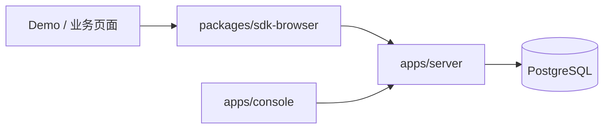

# FP/FCP MVP 0.1 设计

## 1. 目标

用最少组件验证性能平台的完整产品链路：业务页面接入 SDK 后采集 FP/FCP，经 Node.js API 校验并保存到 PostgreSQL，用户在免登录 Vue Console 中查看摘要和时间趋势。

## 2. 范围

### 2.1 包含

- 单应用，通过 `APP_ID` 环境变量固定配置。
- 免登录 Console。
- 浏览器 SDK 采集 FP、FCP。
- 版本化批量事件上报协议。
- 基础校验、标准化和无效事件丢弃。
- PostgreSQL 明细存储。
- FP/FCP 样本量、平均值、P50、P75、P90 和时间趋势。
- Vue Console、接入 Demo 和 Docker Compose。

### 2.2 不包含

登录、团队、项目管理、Redis、ClickHouse、独立服务拆分、其他性能指标、异常、告警、诊断、远程配置和多端 SDK。

## 3. 方案比较与决策

| 方案 | 优点 | 缺点 | 决策 |
|---|---|---|---|
| Node.js 单体 + PostgreSQL | 部署少、链路完整、可验证真实持久化 | 不适合长期大规模事件分析 | 采用 |
| 完整网关/队列/ClickHouse | 接近目标架构 | 对两个指标过度设计 | 后期引入 |
| 内存/JSON 文件 | 开发极快 | 重启丢失、无法验证查询与迁移 | 不采用 |

## 4. 运行架构



开发仓库采用 pnpm workspace：

```text
apps/
  server/       Fastify API、校验、存储和统计查询
  console/      Vue 3 可视化后台
  demo-web/     SDK 接入示例
packages/
  protocol/     事件和 API 公共类型
  sdk-browser/  FP/FCP SDK
deploy/
  docker-compose.yml
```

## 5. 技术栈

- TypeScript、Node.js、Fastify。
- Vue 3、Vite、ECharts。
- PostgreSQL 16。
- pnpm workspace。
- Vitest、Playwright。
- Docker Compose、Nginx。

MVP 不使用 NestJS、Redis、ClickHouse 和 Turborepo；当包数量和任务编排需要时再引入 Turborepo。

## 6. SDK 设计

### 6.1 使用方式

```ts
import { createPaintMonitor } from '@performance-platform/browser'

const monitor = createPaintMonitor({
  appId: 'demo-web',
  endpoint: 'http://localhost:3000/api/v1/events/batch',
})

monitor.start()
```

### 6.2 采集

SDK 使用 `PerformanceObserver` 观察 `paint`，并设置 `buffered: true` 读取 SDK 初始化前已经产生的条目。仅接受：

- `first-paint` → `web.paint.fp`
- `first-contentful-paint` → `web.paint.fcp`

`startTime` 必须为有限且非负的毫秒数。不支持 Paint Timing 或观察失败时静默停用采集，可通过调试回调暴露原因，但不得影响业务。

### 6.3 上报

MVP 维护有界内存队列：收齐当前 paint 条目后立即批量上报；页面隐藏时再次 flush。优先 `sendBeacon`，否则使用 `fetch`。每批最多 20 条；失败只记录调试信息，不做持久化离线重试。

## 7. 事件协议

```ts
type PaintMetric = 'web.paint.fp' | 'web.paint.fcp'

interface PaintEvent {
  schemaVersion: '1.0'
  eventId: string
  appId: string
  type: PaintMetric
  timestamp: number
  sessionId: string
  viewId: string
  sdk: { name: string; version: string }
  payload: { value: number; unit: 'ms' }
}

interface BatchRequest {
  events: PaintEvent[]
}
```

服务端只接受环境变量指定的 `APP_ID`。批次为空、超过 20 条或请求体超过 32 KB 时拒绝整个请求；批次内无效事件单独丢弃，有效事件仍写入。响应返回 `accepted`、`discarded` 和按原因聚合的 `reasons`。

## 8. 服务端模块

```text
HTTP route
  → validateBatch
  → normalizePaintEvent
  → EventRepository.insertBatch
  → PostgreSQL

metrics route
  → PaintMetricsService.query
  → EventRepository.aggregatePaint
```

虽然部署为一个进程，但校验、标准化、仓储和统计查询不得写在同一个路由函数中。Repository 接口为未来 ClickHouse 实现保留替换点。

## 9. 数据模型

```sql
CREATE TABLE paint_events (
  id BIGSERIAL PRIMARY KEY,
  event_id UUID NOT NULL UNIQUE,
  schema_version TEXT NOT NULL,
  app_id TEXT NOT NULL,
  event_type TEXT NOT NULL CHECK (event_type IN ('web.paint.fp', 'web.paint.fcp')),
  event_time TIMESTAMPTZ NOT NULL,
  received_at TIMESTAMPTZ NOT NULL DEFAULT now(),
  session_id TEXT NOT NULL,
  view_id TEXT NOT NULL,
  sdk_name TEXT NOT NULL,
  sdk_version TEXT NOT NULL,
  value_ms DOUBLE PRECISION NOT NULL CHECK (value_ms >= 0)
);

CREATE INDEX paint_events_query_idx
  ON paint_events (app_id, event_type, event_time);
```

重复 `event_id` 视为幂等成功，不重复计数。

## 10. API

### 10.1 批量接收

```http
POST /api/v1/events/batch
Content-Type: application/json
```

```json
{
  "accepted": 2,
  "discarded": 0,
  "reasons": {}
}
```

### 10.2 指标查询

```http
GET /api/v1/metrics/paint?from=...&to=...&interval=hour
```

`interval` 只允许 `minute`、`hour`、`day`。默认最近 24 小时和 `hour`，最大查询范围 30 天。

```json
{
  "range": { "from": "...", "to": "...", "interval": "hour" },
  "summary": {
    "fp": { "count": 120, "average": 312.4, "p50": 290, "p75": 360, "p90": 480 },
    "fcp": { "count": 118, "average": 482.1, "p50": 450, "p75": 540, "p90": 700 }
  },
  "series": [
    { "time": "...", "fp": { "count": 10, "average": 300, "p50": 280, "p75": 350, "p90": 430 }, "fcp": { "count": 9, "average": 470, "p50": 440, "p75": 520, "p90": 650 } }
  ]
}
```

空指标返回 `count: 0`，其余统计值为 `null`，不能返回 0。

## 11. Console

单页布局包含：

- 标题和“最近更新时间”。
- 时间范围：最近 1 小时、24 小时、7 天、30 天。
- FP 摘要：样本量、平均值、P50、P75、P90。
- FCP 摘要：同上。
- 一张 FP/FCP 平均值趋势图。
- 一张 P75 趋势图。
- 接入说明入口。

必须处理加载、无数据、查询失败和正常四种状态。Console 不直接访问 PostgreSQL，不包含登录和应用选择器。

## 12. Demo

Demo 展示普通文本、样式和图片，并在页面显示 SDK 启动状态。提供开发配置指向本地 API。Demo 不人工伪造 FP/FCP；端到端测试以浏览器真实 Paint Timing 条目为准。

## 13. 错误与安全

- API 配置 CORS 允许来源，默认只允许本地 Demo 和 Console。
- 使用 Fastify 请求体限制 32 KB。
- 查询参数严格校验，SQL 参数化。
- API 错误返回稳定错误码，不暴露堆栈和数据库信息。
- SDK 捕获全部内部错误，不改写全局 API。
- 事件只含性能值和匿名随机标识，不采集 URL、用户输入或身份数据。

## 14. 测试

- SDK：条目映射、重复 start、无能力降级、flush 和错误隔离。
- 协议：批次、类型、数值、appId 和边界校验。
- Repository：幂等写入、范围查询、平均值和分位数。
- API：部分成功、空结果、非法时间和最大范围。
- Console：加载、无数据、错误、正常渲染。
- E2E：打开 Demo，等待真实 FP/FCP，上报后在 Console/API 查到数据。

## 15. 后期演进

| 触发条件 | 演进 |
|---|---|
| 上报影响查询 | 将接收路由拆为 Ingestion Gateway |
| 需要削峰/异步处理 | Repository 前增加 Redis Stream |
| 清洗规则复杂 | 将 Validator/Normalizer 拆为 Access Processor |
| 需要会话、告警和诊断 | 拆出 Compute Engine |
| PostgreSQL 聚合或保留成本过高 | 新增 ClickHouse Repository 并迁移明细 |

## 16. 验收标准

从全新环境执行 Docker Compose 后，打开 Demo 能产生真实 FP/FCP；API 接收并在 PostgreSQL 中幂等保存；查询 API 返回正确摘要和趋势；免登录 Console 能展示可视化结果；关闭 API 或使用不支持的浏览器能力时，Demo 仍可正常使用。
