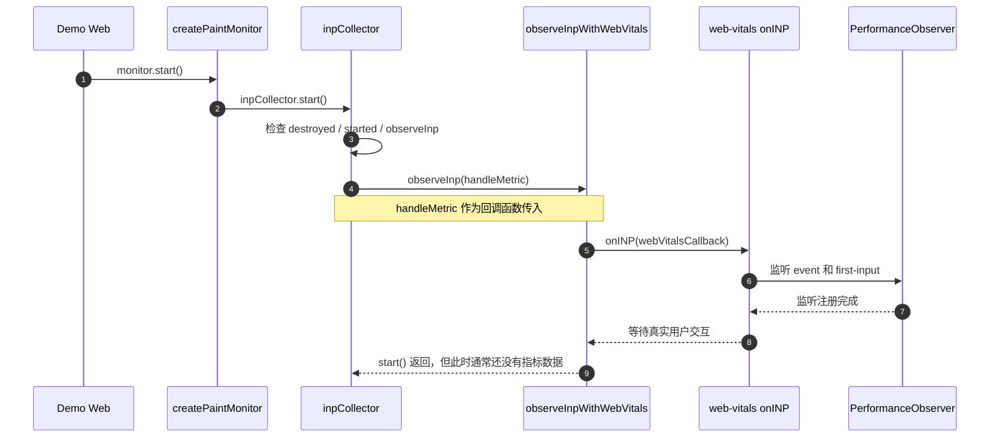
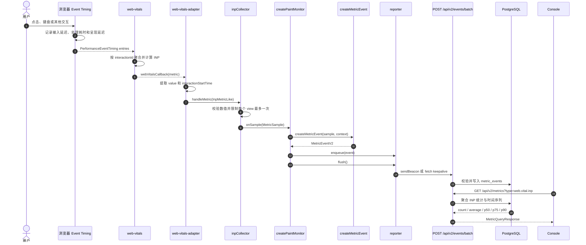
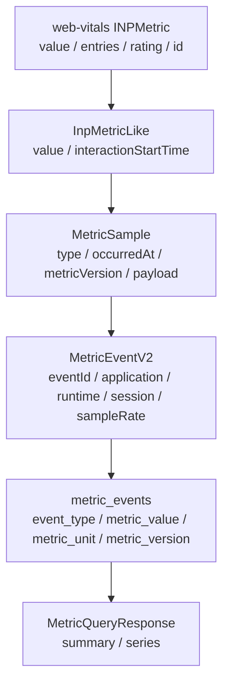
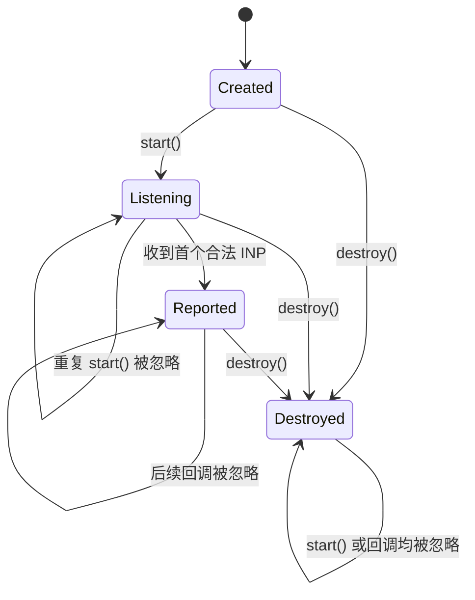

# INP 采集与上报流程

本文说明浏览器 SDK 从 `start()` 注册监听，到 INP 数据进入服务端和 Console 的完整调用链。

## 1. 启动与监听注册



`start()` 的主要作用是建立监听关系，并不是立即读取 INP。最关键的一行是：

```ts
options.observeInp(handleMetric)
```

它表示把 `handleMetric` 交给适配器保存。当浏览器产生可用的 INP 数据时，适配器再调用这个函数。

## 2. 交互、回调与上报



## 3. 回调函数如何串联

```mermaid
flowchart LR
    A["inpCollector.start()"] --> B["observeInp(handleMetric)"]
    B --> C["observeInpWithWebVitals(callback)"]
    C --> D["callback 等于 handleMetric"]
    D --> E["onINP(webVitalsCallback)"]
    E -->|稍后产生 metric| F["callback(convert(metric))"]
    F --> G["handleMetric(InpMetricLike)"]
    G --> H["onSample(MetricSample)"]
    H --> I["enqueueMetricSample"]
    I --> J["MetricEventV2"]
    J --> K["reporter.flush()"]
```



将中间变量展开后，核心关系可以简化成：

```ts
onINP((metric) => {
    handleMetric({
        value: metric.value,
        interactionStartTime:
            metric.entries[0]?.startTime ?? 0,
    })
})
```

因此这里是“先注册、后回调”：

1. `start()` 阶段把函数交给 `web-vitals`。
2. 用户稍后产生真实交互。
3. 浏览器把性能条目交给 `web-vitals`。
4. `web-vitals` 计算完成后反向调用先前注册的函数。

## 4. 数据形态转换



各层职责如下：

- `web-vitals`：处理浏览器原始 Event Timing 条目并计算 INP。
- Adapter：隔离第三方库的数据结构，只保留 Collector 需要的字段。
- Collector：校验数据并生成 SDK 内部统一的 `MetricSample`。
- Monitor：补充应用、运行时、会话、采样率和事件 ID。
- Reporter：负责批量队列及 `sendBeacon`/`fetch` 传输。
- Server：协议校验、持久化和聚合查询。
- Console：展示 INP 的平均值、P75 和样本量。

## 5. 生命周期与保护条件



这些条件用于保证：

- 重复调用 `start()` 不会重复注册监听。
- `destroy()` 后不再向业务链路输出数据。
- 非有限数、负数等异常指标不会进入协议层。
- 当前设计下，每个页面视图最多产生一条 INP 样本。

## 6. 对应源码

- `packages/sdk-browser/src/create-paint-monitor.ts`：组织 Collector、事件工厂和 Reporter。
- `packages/sdk-browser/src/inp-collector.ts`：INP 校验、状态控制和 `MetricSample` 输出。
- `packages/sdk-browser/src/web-vitals-adapter.ts`：连接 `web-vitals/onINP`。
- `packages/sdk-browser/src/metric-event.ts`：将 Sample 与公共上下文组合成 V2 事件。
- `packages/sdk-browser/src/reporter.ts`：队列、Beacon 和 Fetch 上报。
- `apps/server/src/routes/events.ts`：服务端批量接收入口。
- `apps/server/src/routes/metric-query.ts`：通用指标查询入口。

