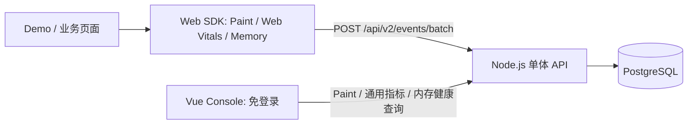
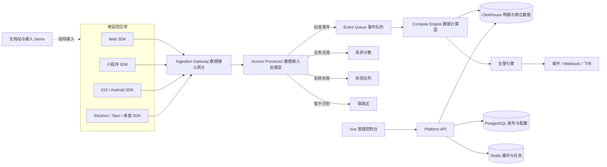

# 开源多端性能监控与异常诊断平台设计

## 1. 项目定位

建设一套可自托管、易接入、可扩展的开源应用性能平台，统一监控 Web、小程序、移动 App 和桌面应用。

平台由多端采集 SDK、采集与处理服务、数据存储、管理控制台、告警诊断、文档站和接入 Demo 组成。第一阶段面向中小团队：10～50 个应用、日均 100 万以内事件，通过 Docker Compose 一键部署；架构预留水平扩展能力。

## 2. 目标与边界

### 2.1 核心目标

- 自动采集启动、加载、渲染、卡顿、内存、网络和异常数据。
- 提供账号登录、项目管理、性能看板、异常中心、问题诊断和告警。
- 支持原生接入、框架插件和自定义业务监控。
- 统一多端事件协议、查询维度和告警能力，同时保留平台特有指标。
- 提供完整的安装部署、SDK 接入、指标口径、异常排查文档和故障 Demo。

### 2.2 首版不做

- 不同时交付所有端的完整 SDK；首版交付 Web，后续逐步扩展。
- 不以微服务、Kubernetes、多地域高可用作为默认部署方式。
- 不默认采集输入内容、响应正文等敏感数据。
- 不在首版实现计费、商业 SaaS 多租户和复杂企业 SSO。

## 3. 总体架构

### 3.1 当前实现：v0.2

v0.2 在单体部署内完成 Web Vitals、会话采样和实验性内存监控闭环，不部署完整数据平台组件：



Node.js 单体内部仍保持 `HTTP → Validator → Normalizer → Repository → Query Service` 边界。SDK 使用版本化标准事件协议；Console 只依赖稳定查询 API。后期可以在不修改 SDK 语义和 Console 查询契约的前提下，将 HTTP 接入、处理、计算和 ClickHouse 存储逐步拆出。

v0.2 不包含登录、团队、项目管理、Redis、ClickHouse、独立接入网关、独立数据处理/计算服务和外部告警。内存健康仅作为 Console 风险提示。以下章节描述 MVP 1.0 及后续目标架构。

### 3.2 目标架构：MVP 1.0 及后续



一次完整数据流：SDK 批量上报；Ingestion Gateway 完成 HTTP 接入、鉴权和限流；Access Processor 校验、推导、清洗、去重并生成标准事件；Compute Engine 完成事件派生、会话关联、指标聚合、诊断和告警计算；控制台通过 Platform API 查询结果。

首版包含 `console`、`api`、`ingestion-gateway`、`access-processor`、`compute-engine` 五个逻辑组件。为降低部署成本，`access-processor` 可先与网关同进程部署，计算层保持独立进程。代码可放在同一 Monorepo，但仓库结构不等于运行架构。

## 4. 组件设计

### 4.1 多端 SDK

SDK 采用“平台采集器 + 公共能力 + 统一协议”三层设计。

公共能力包括初始化、身份与会话、上下文、采样、离线缓存、批量上报、远程配置、数据脱敏、调试日志、插件注册和安全卸载。平台采集器独立实现，不用一个 JavaScript 包强行覆盖所有平台。

| 平台 | 实现方式 | 主要指标 |
|---|---|---|
| Web | 原生 TypeScript/JavaScript | 秒开率、首屏、Web Vitals、长任务、资源、接口、JS 异常 |
| 小程序 | TypeScript + 平台适配器 | 冷/热启动、页面切换、setData、请求、脚本异常、内存 |
| iOS | Swift | 启动、主线程卡顿、掉帧、崩溃、网络、内存、OOM 线索 |
| Android | Kotlin | 启动、卡顿、掉帧、ANR、Crash、网络、内存 |
| React Native / Flutter | JS/Dart + Native Bridge | 跨端页面指标、异常及原生性能 |
| Electron / Tauri | Web SDK + Node/Rust 插件 | 页面、主进程、CPU、内存和崩溃 |

Web SDK 的主体是零框架依赖的原生 Core。Vue、React 等包只是薄适配器，负责初始化、路由、生命周期和框架错误：

```ts
const monitor = createMonitor(config)
monitor.use(customPlugin)
monitor.start()
```

Vue 可提供 `app.use(createMonitorPlugin(config))`，但业务插件依赖 Core SDK，而非依赖 Vue。

### 4.2 Ingestion Gateway 数据接入网关

职责限定在 HTTP 边界：项目密钥和来源校验、IP/项目/设备维度限流、请求体大小限制、解压、批次拆分、基础协议版本检查、记录服务端接收时间，并将事件交给 Access Processor。网关不进行复杂清洗、统计、登录和看板查询。

限流默认采用项目级令牌桶并叠加 IP 保护阈值；超限返回 HTTP 429 和 `Retry-After`，SDK 指数退避。Redis 故障时启用有界的本地保护阈值，不能无限放行。单请求事件数、请求体积和单事件体积均需配置上限。

### 4.3 Access Processor 数据接入处理层

该层把不可信的原始事件转换为可信的标准事件：

```text
Schema 校验 → 类型/范围校验 → 无效数据识别 → 缺失数据推导
→ 字段标准化 → 隐私清洗 → 去重/递归上报过滤 → 标准事件
```

处理规则：

- `appId`、事件类型等必要字段缺失，或类型、范围、时间关系明显无效时，直接丢弃。
- 必要字段缺失时按已注册规则尝试推导；精确推导成功后接收，推导失败则丢弃。
- 近似推导标记为 `estimated`，默认不进入核心 SLA 指标，只用于辅助诊断。
- 非必要指标缺失时，仅将该指标标记为 `unavailable`，不丢弃整条仍有价值的事件。
- 客户端时钟异常时，结合服务端接收时间和已知时钟偏差校正；无法可靠校正且影响必要字段时丢弃。
- 重复事件、SDK 自身递归上报、超期事件、超长字段和不支持协议按明确原因处理。

推导必须记录规则和可信度：

```ts
{
  duration: 820,
  derived: {
    duration: { rule: 'endTime-minus-startTime', confidence: 'exact' }
  }
}
```

业务无效数据进入 `discard`，只记录低基数原因计数且不重试；暂时性系统失败进入 `dead letter`，允许重放；协议升级期间暂不识别的事件进入带自动过期时间的 `quarantine`。原始请求体默认不落盘。

丢弃计数至少包含 `app_id`、`platform`、`event_type` 和 `reason`；禁止将原始敏感数据写入丢弃日志。平台应展示接收量、接收率、丢弃率、推导成功率、死信量和隔离量，以便发现 SDK 或协议质量问题。

首版标准事件通过 Redis Stream 投递；达到千万级日事件后可替换为 Kafka，不改变 SDK 和标准事件协议。

### 4.4 Compute Engine 数据计算层

数据接入处理层保证单条事件合法，数据计算层负责：

- **事件计算**：秒开、长任务、请求成功、内存阈值、异常指纹和维度归一化。
- **会话计算**：关联启动、首屏、资源、卡顿和异常，判断会话完整性与有效性。
- **窗口聚合**：生成分钟、小时、天维度的计数、去重用户/会话、成功率、秒开率、卡顿率及 P50/P75/P90/P99。
- **诊断计算**：异常聚类、Source Map/符号表定位、慢资源贡献度、弱网/设备相关性和版本回归。
- **告警计算**：连续窗口、最小样本量、阈值、防抖、静默和恢复判断。

计算必须定义事件时间与接收时间、去重键、迟到/乱序容忍窗口、时区、采样权重、有效分母和重算策略。聚合结果必须能追溯到指标版本和计算规则版本。

诊断结果必须包含证据、影响范围和建议，避免输出不可解释的“健康分”。

### 4.5 Platform API 与管理控制台

Platform API 负责账号认证、RBAC、团队、项目、应用密钥、版本、查询、诊断、告警、Source Map 和平台配置。

控制台主要页面：

- 登录、团队与项目管理。
- 总览：活跃用户、秒开率、启动、首屏、卡顿和异常趋势。
- 页面/场景分析：趋势、分位数、版本与多维对比。
- 卡顿、内存、网络、资源和异常中心。
- 用户会话时间线和问题诊断。
- 告警规则、静默、恢复和通知记录。
- SDK 接入、采样、数据脱敏和 Source Map 设置。

不同平台使用不同看板模板；版本、环境、用户、设备、地区、网络、会话、异常和告警是公共维度。

## 5. 指标体系

| 类别 | 公共指标 | 平台特有示例 |
|---|---|---|
| 启动与加载 | 成功率、耗时、秒开率、分位数 | Web 首屏/LCP；App 冷/热启动；小程序首次渲染 |
| 流畅度 | 卡顿率、卡顿次数、影响会话 | Web Long Task；App 掉帧/ANR；小程序 setData |
| 资源 | 加载耗时、体积、失败率 | Web 静态资源；App 包与动态资源 |
| 网络 | 请求耗时、成功率、错误码、弱网分布 | 各端网络栈差异 |
| 稳定性 | 异常率、崩溃率、影响用户、版本回归 | JS Error、Crash、ANR、OOM |
| 内存 | 当前值、峰值、增长趋势、告警 | Web 仅部分运行时可用；App/桌面能力更完整 |
| 业务 | 自定义事件、计时、计数和 Span | 登录、下单、支付等业务链路 |

秒开率必须允许项目配置阈值，例如“首屏不超过 1 秒的有效会话占比”。所有比例指标必须明确有效分母、去重方式、采样影响、时区和聚合周期。

## 6. 兼容性与降级

### 6.1 平台兼容

- 各平台维护独立 SDK 和能力矩阵，共享语义规范与测试契约。
- 统一事件类型，同时允许 `platformPayload` 保留平台专属信息。
- 新平台通过适配器接入，不修改核心存储和查询模型。

### 6.2 Web 兼容

- 使用能力检测，不根据浏览器名称硬编码。
- Navigation Timing、PerformanceObserver、Long Tasks、sendBeacon 等能力逐项检测和降级。
- Long Tasks 不可用时可使用定时器漂移近似；内存 API 不可用时明确标记 unavailable。
- SSR 加载阶段不访问 `window`；支持 MPA、SPA、Hash/History 路由、iframe 和微前端。
- 包装 fetch/XHR/history 时保持原行为，可重复初始化、卸载和还原，SDK 异常不得冒泡到业务。
- 输出 ESM、CJS、CDN UMD；旧浏览器支持放入独立 legacy 包。

事件需携带 SDK 版本和能力位。服务端统计某项指标时，只把支持并成功采集该指标的会话放入分母，不能用 `0` 代替缺失数据。

## 7. 统一事件协议

```ts
interface MonitorEvent {
  schemaVersion: string
  eventId: string
  type: string
  timestamp: number
  application: { id: string; version: string; environment: string }
  runtime: {
    platform: 'web' | 'miniapp' | 'ios' | 'android' | 'desktop'
    framework?: string
    sdkName: string
    sdkVersion: string
    capabilities?: Record<string, boolean>
  }
  session: { sessionId: string; userId?: string; deviceId?: string }
  context: Record<string, unknown>
  measurements: Record<string, number>
  payload: Record<string, unknown>
}
```

标准事件族：`performance.startup`、`performance.render`、`performance.freeze`、`performance.memory`、`performance.network`、`error.javascript`、`error.crash`、`error.anr`、`error.resource`、`business.custom`。

协议必须版本化；新增字段默认可选，服务端兼容多个协议版本，单条未知事件不能导致整批失败。

## 8. 告警与诊断

告警规则支持指标、事件、阈值、持续时间、最小样本量、过滤维度和通知渠道。例如：“生产环境 5 分钟内首页卡顿率大于 5%，且有效会话超过 100”。

必须具备：连续窗口检测、告警合并、防抖、静默期、恢复通知、频率限制和通知失败重试。首版渠道为 Webhook 和邮件，飞书等通过 Webhook 接入。

问题诊断按以下证据链输出：

```text
现象 → 影响用户/会话 → 首次出现版本 → 相关页面和设备
     → 慢资源/长任务/异常指纹 → 可执行建议
```

## 9. 数据与技术栈

| 模块 | 推荐技术 |
|---|---|
| Monorepo | pnpm workspace + Turborepo |
| Web SDK | TypeScript + Rollup/Vite Library Mode |
| 控制台 | Vue 3 + TypeScript + Vite + ECharts |
| Platform API | NestJS + Fastify Adapter |
| Ingestion Gateway | Fastify + TypeScript |
| Access Processor | TypeScript 规则流水线 |
| Compute Engine | TypeScript Worker + ClickHouse 聚合 |
| 配置与事务数据 | PostgreSQL |
| 性能与异常事件 | ClickHouse |
| 缓存与异步任务 | Redis + BullMQ/Redis Stream |
| 文档 | VitePress |
| 测试 | Vitest + Playwright + Testcontainers |
| 部署 | Docker Compose + Nginx |
| 平台自身观测 | OpenTelemetry + Prometheus |

ClickHouse 保存高写入、低更新、多维聚合的观测事件；PostgreSQL 保存用户、团队、项目、密钥、权限、告警规则和诊断配置；Redis 不作为事实数据源。

## 10. 安全与隐私

- 全链路 TLS；应用公钥只用于上报，管理密钥不进入客户端。
- 登录使用短期 Access Token、可轮换 Refresh Token 和 Argon2 密码哈希。
- RBAC 最少包含管理员、维护者、开发者和只读成员。
- 支持来源白名单、IP/项目限流、密钥轮换和审计日志。
- URL 参数、Header、用户标识、请求字段按白名单采集；默认不采集输入内容、Cookie 和响应正文。
- 用户 ID 支持哈希；支持数据保留周期、项目级删除和导出。
- Source Map/符号表作为私有制品存储，不向普通访客暴露。

## 11. 非功能要求

首版基线目标：

- 规模：10～50 个应用，日均不超过 100 万事件，峰值按平均值 5 倍设计。
- SDK：核心包尽量小于 20 KB gzip；初始化不阻塞首屏；采集 CPU 平均开销低于 1%；批量上报且可配置采样。
- Ingestion Gateway：单实例持续接收不少于 1,000 events/s；接收接口 p95 小于 100 ms。
- Access Processor：处理吞吐不低于接入吞吐，丢弃、推导、死信和积压均有可观测指标。
- 查询：常用看板在 24 小时时间范围内 p95 小于 2 秒。
- 可用性：默认单机部署目标 99.5%；支持备份后 RPO 24 小时、RTO 4 小时。
- 数据：默认保留 30 天明细和更长时间聚合数据，均可配置。
- 可运维性：结构化日志、服务指标、健康检查、数据积压和写入失败告警。

以上是项目目标而非未经验证的承诺，应通过容量测试校准。

MVP 默认业务参数统一采用：秒开 1,000 ms、长任务 50 ms、严重卡顿 200 ms、慢请求 1,000 ms、会话超时 30 分钟、迟到窗口 10 分钟、明细保留 30 天、秒开率告警每窗口最小样本 100、内存使用率大于 80% 且连续 3 个有效采样点告警。慢请求阈值支持按标准化请求方法和 URL 模式进行接口级覆盖；全部参数变更必须记录规则版本。

## 12. 失败模式与处理

| 失败 | 影响 | 处理 |
|---|---|---|
| 网络断开 | 客户端事件无法上报 | 有界离线队列、指数退避、过期丢弃 |
| 上报突增 | 接入网关过载 | 项目限流、采样、批量、队列削峰 |
| Redis/队列故障 | 处理延迟 | 本地有界缓冲、健康告警、恢复后重试 |
| ClickHouse 不可用 | 数据积压 | 暂停消费、重试、死信记录和积压告警 |
| PostgreSQL 不可用 | 登录和配置不可用 | 已缓存配置短时生效，停止危险写操作 |
| 异常事件风暴 | 存储和通知过载 | 指纹聚合、频率限制、告警合并 |
| SDK 自身异常 | 影响被监控应用 | 全边界捕获、熔断停用、绝不向业务冒泡 |
| 协议不兼容 | 部分事件拒收 | 版本适配、单条隔离、死信和可观测错误码 |
| 时钟不准确 | 时间线错乱 | 同时记录客户端和服务端接收时间并估算偏差 |

## 13. 测试策略

- SDK 单元测试：指标计算、采样、缓冲、插件生命周期和隐私清洗。
- 契约测试：所有平台 SDK 对同一事件协议运行一致性测试。
- 浏览器测试：Playwright 覆盖 Chromium、Firefox、WebKit、SPA/MPA/SSR 和弱网。
- 侵入性测试：验证 fetch/XHR/history 包装、多个 SDK 共存及 destroy 后还原。
- 集成测试：从 Demo 产生事件，经过接入网关、接入处理、事件队列、计算层、数据库到控制台查询。
- 数据质量测试：覆盖无效事件丢弃、缺失字段精确/近似推导、单项指标降级、死信重放和隔离过期。
- 故障测试：数据库不可用、队列积压、重复事件、乱序事件和异常风暴。
- 容量测试：验证百万日事件基线、查询延迟及告警时效。
- 安全测试：鉴权绕过、越权、伪造 appId、敏感字段泄漏和上传制品访问控制。

## 14. 文档与 Demo

文档站至少包含：快速开始、Docker Compose 部署、各 SDK 接入、指标口径、兼容矩阵、配置说明、插件开发、隐私安全、升级迁移、告警配置和常见异常帮助。

Demo 应可主动制造慢首屏、长任务、内存增长、慢接口、资源失败、JS 异常和版本回归，并展示“产生问题—收到事件—看板分析—触发告警—查看诊断”的完整闭环。

## 15. 开源仓库结构

```text
apps/
  console/             管理控制台
  api/                 平台 API
  ingestion-gateway/   HTTP 接入、鉴权和限流
  access-processor/    校验、推导、清洗和标准化
  compute-engine/      派生、关联、聚合、诊断和告警计算
  docs/                文档站
  demo-web/            Web 接入及故障 Demo
packages/
  protocol/            统一事件协议
  sdk-core/            Web 原生 Core
  sdk-browser/         浏览器发行包
  sdk-vue/             Vue 薄适配器
  diagnostics/         诊断规则
  shared/              公共类型和工具
deploy/
  docker-compose/
```

后续平台 SDK 可按语言生态拆分独立仓库，协议和服务端保持稳定。

## 16. 交付路线图

### 阶段一：Web MVP

统一协议、Web Core/Vue 插件、接入网关、接入处理层、事件队列、计算层、账号项目、ClickHouse/PostgreSQL、基础看板、异常中心、Webhook/邮件告警、文档和 Demo。

### 阶段二：多端验证

微信小程序和 Electron SDK；完善平台差异化看板、远程配置、Source Map 和会话诊断。

### 阶段三：跨端与原生

React Native、Flutter、iOS、Android；补充 Crash、ANR、OOM、掉帧和符号表解析。

### 阶段四：规模化

Kafka、水平扩容、预聚合、对象存储、OIDC/SSO、Kubernetes 部署和企业级治理。

## 17. 关键架构决策（ADR 摘要）

### ADR-001：统一协议，平台 SDK 独立实现

- **状态**：接受。
- **决定**：共享事件语义、公共行为和契约测试；Web、小程序、原生及桌面分别实现采集器。
- **收益**：避免最低公分母设计，保留平台能力，服务端仍可统一。
- **代价**：需要维护多语言 SDK 和跨端一致性测试。
- **替代方案**：单一 JavaScript SDK；因无法可靠覆盖原生平台而拒绝。

### ADR-002：模块化单体优先，而非首版微服务

- **状态**：接受。
- **决定**：Platform API 使用模块化单体；Ingestion Gateway 独立；Access Processor 首版可与网关同进程；Compute Engine 独立进程部署。
- **收益**：一键部署、低运维成本，并隔离采集流量。
- **代价**：规模增长后需拆分部分模块。
- **替代方案**：纯单体缺少流量隔离；完整微服务对首版过度设计。

### ADR-003：PostgreSQL + ClickHouse + Redis

- **状态**：接受。
- **决定**：事务配置使用 PostgreSQL，观测事件使用 ClickHouse，Redis 用于缓存和异步任务。
- **收益**：数据模型与数据库能力匹配，兼顾事务一致性和分析吞吐。
- **代价**：默认部署包含三个数据组件，备份和运维更复杂。
- **替代方案**：仅 PostgreSQL 部署更简单，但大量事件聚合与保留成本更高。

### ADR-004：Web SDK 采用原生 Core + 薄框架适配器

- **状态**：接受。
- **决定**：浏览器原生 API 和插件机制放入 Core；Vue/React 只补充框架生命周期、路由和错误信息。
- **收益**：体积更小、框架无关、指标口径统一、社区易扩展。
- **代价**：框架高级能力需在适配器中分别维护。
- **替代方案**：框架专属 SDK 会重复核心逻辑并限制接入面。

## 18. 验收标准

MVP 完成应满足：新用户可在 30 分钟内通过 Docker Compose 启动平台并登录；按文档在 Demo 或现有 Web 项目中完成 SDK 接入；平台能展示首屏、秒开率、Web Vitals、长任务、内存能力状态、网络和异常；能按版本、页面、设备和网络筛选；能配置并收到带诊断证据的告警；SDK 失效或平台不可用时不影响被监控业务。
